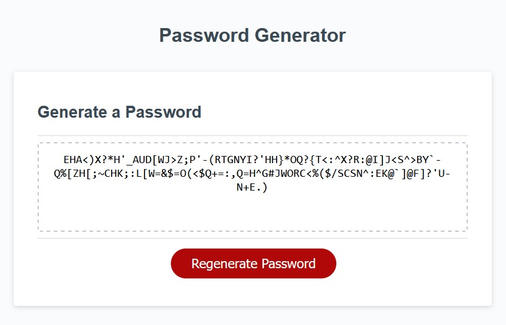

# Module 3 Weekly Challenge - Password Generator

## Description

In today's day and age, it is essential to have strong cybersecurity methods in place, both in your personal life, and professional life. While it shouldn't be your only line of defense, having a strong password is a cornerstone of these methods. As such, this web application allows a user to randomly generate a secure password based on criteria of their choosing.

## Usage

Use the password generator here;

https://average-kirigiri-enjoyer.github.io/challenge-3-password-generator/

On the page, there will be a card beginning with the text "Generate a Password", at the bottom of which will be a red button with the text "Generate Password". Click it, and you will be presented with a series of prompts, asking for the desired password length, and what types of characters to include. After completing them all, the password will be displayed in the center of the card, just above the button.

## Preview

## Credits

isNan() syntax (./assets/script.js, line 15);
https://stackoverflow.com/questions/2652319/how-do-you-check-that-a-number-is-nan-in-javascript

if (!array.length) syntax (./assets/script.js, line 57);
https://stackoverflow.com/questions/24403732/how-to-check-if-array-is-empty-or-does-not-exist

Math.random() syntax (./assets/script.js, line 70);
https://www.w3schools.com/js/js_random.asp

## License

Operates under a standard MIT license, refer to the LICENSE file in the repository for more information.
